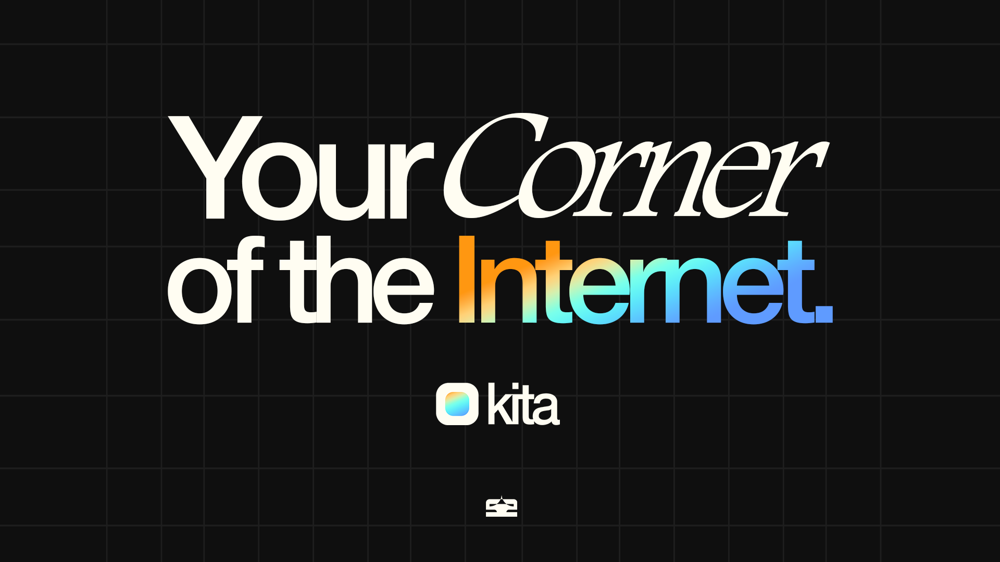

<div align="center">
    
# ✧ KITA ✧

[![License]](LICENSE)


  


</div>

<div align="center">
    


### *Your Corner of the Internet, But Make It Aesthetic.* ✨


[](https://github.com/Batkixni/Kita/watchers)  
[](https://github.com/Batkixni/Kita/stargazers)


[English](#english) | [正體中文](#chinese)

</div>

## English

Welcome to **Kita**. It's basically the coolest way to build your own personal page. Forget those basic link trees; we're talking full-on grid layouts, drag-and-drop vibes, and modules that actually do stuff. It's giving *main character energy*. 💅

Whether you're a developer, designer, or just an aesthetic enjoyer, Kita lets you flex your projects, socials, and whatever else defines *you*.


---

## 🔥 Features that Slap

*   **Grid Layout System**: Drag, drop, resize. Treat your page like a bento box. 🍱
*   **Rich Modules**:
    *   **Link Cards**: Auto-scrapes metadata (Title, Image, Icon) so your links don't look crusty.
    *   **X/Twitter Embeds**: Special dark-mode cards for your hot takes.
    *   **YouTube**: Channel previews that update automatically.
*   **Themes**: Switch between light/dark or make your own, also support bunch of color schemes from [shadcn/studio](https://shadcnstudio.com/).
*   **Invite System**: Keep it exclusive. No normies allowed (unless you give them a code). 🤫

---

## 🚀 How to Deploy (IRL)

Want this live? Bet. The easiest way is **Zeabur** + **Turso**.

### 1. Database (Turso)
1.  Go to [Turso.tech](https://turso.tech/) and make a DB.
2.  Get your `DATABASE_URL` and `DATABASE_AUTH_TOKEN`.

### 2. The Code (Zeabur)
1.  Fork this repo.
2.  Import to Zeabur.
3.  Add these Environment Variables:
    ```bash
    DATABASE_URL="libsql://your-db.turso.io"
    DATABASE_AUTH_TOKEN="your-secret-token"
    BETTER_AUTH_SECRET="smash-some-keys-make-it-long"
    BETTER_AUTH_URL="https://your-site.zeabur.app" # Your real domain
    NEXT_PUBLIC_ENABLE_INVITE_SYSTEM="true" # Set to false if you want open signups
    ```
4.  Hit **Deploy**.
5.  *Vibe check passed.* ✅

---

## 💻 Running Locally (For the Builders)

Wanna mess with the code? Say less.

1.  **Clone it:**
    ```bash
    git clone https://github.com/Batkixni/Kita.git
    cd kita
    ```

2.  **Install deps:**
    ```bash
    pnpm install
    ```

    or

    ```bash
    npm install
    ```

3.  **Setup Env:**
    Copy `.env.example` to `.env.local` and fill it out.
    *   For local dev, just leave `DATABASE_URL=file:local.db` and we'll handle the rest.

4.  **Launch:**
    ```bash
    pnpm run dev
    ```

    ```bash
    npm run dev
    ```
    Open `http://localhost:3000` and start cooking. 🍳

---

## 🤝 Invite System

Need to let the homies in? We got some scripts for that.

```bash
# List all codes
npx tsx scripts/invites.ts list

# Make a new code
npx tsx scripts/invites.ts generate
```
---

## 🛠️ The Stack 

*   **Framework:** [Next.js 15 (App Router)](https://nextjs.org/) 
*   **Language:** [TypeScript](https://www.typescriptlang.org/) 
*   **Styling:** [Tailwind CSS v4](https://tailwindcss.com/) + [Shadcn UI](https://ui.shadcn.com/) 
*   **Database:** [Turso (LibSQL)](https://turso.tech/) + [Drizzle ORM](https://orm.drizzle.team/) 
*   **Auth:** [Better Auth](https://better-auth.com/) 
*   **Drag & Drop:** `react-grid-layout` 

---

## 📜 License

**GPL-3.0**
If you use this code, you gotta keep it open source. Don't be that guy who closes it up. Share the love. ❤️

---

*Made with love by Bax. issues are open for bug reports and feature requests.* 🤙

---

## Chinese

歡迎來到 **Kita**。這基本上是建立你自己的專屬頁面最酷的方式。忘掉那些陽春的 Link Tree 吧；我們搞的是全網格佈局、拖放操作，以及真正有功能的模組。整個就是讓你有種主角光環的感覺！💅

無論你是開發者、設計師，還是單純的美學愛好者，Kita 都能讓你展示你的專案、社群媒體，以及任何定義*你*的東西。

---

## 🔥 超讚的功能

*   **網格佈局系統**：拖曳、放置、調整大小。把你的頁面當成便當盒來擺。🍱
*   **豐富模組**：
    *   **連結卡片**：自動抓取網頁數據（標題、圖片、圖示），讓你的連結看起來不會很醜。
    *   **X/Twitter 嵌入**：專為你的推文設計的深色模式卡片。
    *   **YouTube**：會自動更新的頻道預覽。
*   **主題**：切換亮色/深色模式或自定義，也支援來自 [shadcn/studio](https://shadcnstudio.com/) 的各種配色方案。
*   **邀請系統**：保持獨特性。普通人進不來（除非你給他們邀請碼）。🤫

---

## 🚀 如何部署 (實戰)

想要上線？沒問題。最簡單的方法是 **Zeabur** + **Turso**。

### 1. 資料庫 (Turso)
1.  去 [Turso.tech](https://turso.tech/) 建立一個 DB。
2.  取得你的 `DATABASE_URL` 和 `DATABASE_AUTH_TOKEN`。

### 2. 程式碼 (Zeabur)
1.  Fork 這個 repo。
2.  匯入到 Zeabur。
3.  加入這些環境變數：
    ```bash
    DATABASE_URL="libsql://your-db.turso.io"
    DATABASE_AUTH_TOKEN="your-secret-token"
    BETTER_AUTH_SECRET="隨便打一些字讓它變很長"
    BETTER_AUTH_URL="https://your-site.zeabur.app" # 你的真實域名
    NEXT_PUBLIC_ENABLE_INVITE_SYSTEM="true" # 如果你想開放註冊就設為 false
    ```
4.  點擊 **Deploy**。
5.  *Vibe check passed.* ✅

---

## 💻 本地執行 (給開發者)

想要改代碼？沒問題。

1.  **Clone 專案:**
    ```bash
    git clone https://github.com/Batkixni/Kita.git
    cd kita
    ```

2.  **安裝依賴:**
    ```bash
    pnpm install
    ```

    或

    ```bash
    npm install
    ```

3.  **設定環境變數:**
    複製 `.env.example` 到 `.env.local` 並填寫。
    *   本地開發的話，只要保留 `DATABASE_URL=file:local.db`，剩下的我們來處理。

4.  **啟動:**
    ```bash
    pnpm run dev
    ```

    ```bash
    npm run dev
    ```
    打開 `http://localhost:3000` 開始動工。🍳

---

## 🤝 邀請系統

需要讓朋友進來嗎？我們有幾個簡單的腳本可以使用。

```bash
# 列出所有代碼
npx tsx scripts/invites.ts list

# 產生新代碼
npx tsx scripts/invites.ts generate
```
---

## 🛠️ 技術堆疊

*   **框架:** [Next.js 15 (App Router)](https://nextjs.org/)
*   **語言:** [TypeScript](https://www.typescriptlang.org/)
*   **樣式:** [Tailwind CSS v4](https://tailwindcss.com/) + [Shadcn UI](https://ui.shadcn.com/)
*   **資料庫:** [Turso (LibSQL)](https://turso.tech/) + [Drizzle ORM](https://orm.drizzle.team/)
*   **驗證:** [Better Auth](https://better-auth.com/)
*   **拖放:** `react-grid-layout`

---

## 📜 授權

**GPL-3.0**
如果你使用這段代碼，你必須保持開源。分享這份愛。❤️

---

*由 Bax 用愛製作。歡迎提交 issue 回報錯誤或請求功能。* 🤙


[License]: https://img.shields.io/github/license/Batkixni/astro-regulus?color=0a0a0a&logo=github&logoColor=fff&style=for-the-badge


